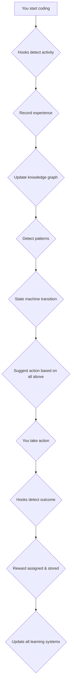

# Unified AI Memory & Self-Improvement System Architecture

**Date:** 2026-01-28
**Version:** 1.0.0
**Philosophy:** Self-improving AI through experience replay, knowledge graphs, and adaptive state machines

---

## Executive Summary

This system creates a **self-improving AI** that learns from your work over time without autonomous agents or cron jobs. It combines cutting-edge research from:

- **Experience Replay** - Reuse past successful actions in similar situations
- **Knowledge Graphs** - Model information as interconnected entities (not flat vectors)
- **Finite State Machines** - Define AI behavior through clear state transitions
- **Spaced Repetition (FSRS)** - Ebbinghaus forgetting curve for optimal review scheduling
- **Pattern Recognition** - Detect recurring behaviors (wins and losses)
- **Reinforcement Learning** - Learn from rewards/penalties to optimize future decisions

**All triggered by HOOKS during your work sessions** - no background automation.

---

## Core Philosophy

### The Problem

Most AI assistants:
1. Forget context between sessions
2. Can't learn from past mistakes
3. Don't adapt to your working style
4. Make the same errors repeatedly
5. Lack long-term behavioral intelligence

### The Solution

A **four-layer architecture** that:
1. **Records experiences** (episodic memory with rewards)
2. **Builds knowledge** (entities with facts and relationships)
3. **Detects patterns** (recurring wins/losses)
4. **Adapts behavior** (state machine + experience replay)
5. **Optimizes reviews** (spaced repetition scheduling)

**You are always in control** - the system only processes data when YOU use it (via hooks) or when YOU call tools.

---

## Four-Layer Architecture

### Layer 1: Experience Store (Episodic Memory)

**Purpose:** Record all interactions with outcomes and rewards for replay learning

**Storage:** `~/clawd/learning/experiences.jsonl`

**Data Model:**
```typescript
interface Experience {
  id: string
  timestamp: string           // ISO 8601
  state: string              // State before action
  action: string             // Tool/method used
  outcome: "success" | "failure" | "partial"
  reward: number            // -1 (bad) to +1 (good)
  confidence: number        // 0-1 (how certain we are)
  context: {
    sessionId: string
    tool?: string
    prompt?: string
    userId?: string
  }
  metadata: Record<string, any>
}

interface ExperienceReplayResult {
  bestAction: string
  expectedReward: number
  confidence: number
  similarExperiences: Experience[]
}
```

**Key Features:**
- ✅ Append-only writes (append to JSONL for performance)
- ✅ Reward system for reinforcement learning
- ✅ Confidence scoring for reliability weighting
- ✅ Similarity search (by state, action, context)
- ✅ Time-based weighting (recent = more relevant)

**Usage:**
```bash
# During your work, hooks automatically record:
# - Code review success (reward: +0.8)
# - Bug fix failure (reward: -0.6)
# - Test passing success (reward: +0.9)
```

---

### Layer 2: Knowledge Graph (Semantic Memory)

**Purpose:** Model information as interconnected entities, not flat vectors

**Storage:** `~/clawd/learning/knowledge_graph/`

**Data Model:**
```typescript
interface KnowledgeNode {
  id: string
  type: "person" | "company" | "project" | "concept" | "skill" | "mistake" | "pattern"
  data: Record<string, any>        // Flexible data storage
  relations: {
    relatedTo: string[]      // Other nodes this connects to
    conflictsWith: string[]     // Contradictory information
    dependsOn: string[]       // Prerequisite nodes
  }
  importance: number            // 0-10 (how critical this is)
  strength: number              // 0-1 (confidence in information)
  lastAccessed: string        // ISO 8601
  accessCount: number          // How often referenced
  metadata: {
    tags: string[]
    source: "experience" | "manual" | "inference"
    created: string
    updated: string
  }
}

interface KnowledgeGraph {
  nodes: Record<string, KnowledgeNode>
  edges: {
    from: string
    to: string
    type: "relates_to" | "causes" | "depends_on" | "conflicts_with"
    weight: number
  }[]
  indexes: {
    byType: Record<string, string[]>
    byImportance: string[]
    byTag: Record<string, string[]>
  }
}
```

**Key Features:**
- ✅ Entity-based storage (not flat key-value)
- ✅ Bidirectional relationships (A relates to B, B relates to A)
- ✅ Conflict detection (mark contradictory facts)
- ✅ Importance weighting (critical info > useful trivia)
- ✅ Access tracking (popularity = relevance)
- ✅ Fast graph queries (path finding, neighbors, subgraphs)

**Why Knowledge Graph > Vector Database:**
- Vectors are black boxes - can't inspect why AI "knows" something
- Graphs show relationships (A is boss of B, C uses library X)
- Graphs handle contradictions (explicit edges)
- Graphs are human-readable and debuggable
- Graphs support multi-hop reasoning (A → B → C)

---

### Layer 3: Pattern Recognition (Behavioral Memory)

**Purpose:** Detect recurring behaviors, wins, and losses

**Storage:** `~/clawd/learning/patterns/`

**Data Model:**
```typescript
interface Pattern {
  id: string
  type: "positive" | "negative" | "neutral"
  category: string            // "coding", "debugging", "design", "process"
  description: string         // Human-readable pattern description
  examples: string[]          // Concrete instances where pattern occurred
  frequency: number           // How often pattern occurs
  firstSeen: string           // ISO 8601
  lastSeen: string            // ISO 8601
  confidence: number           // 0-1 (how certain we are)
  triggers: string[]          // Keywords/situations that trigger pattern
  consequences: string[]       // What happens when pattern occurs
  suggestedActions: string[]   // What to do (or avoid)
  impact: "low" | "medium" | "high" | "critical"
  status: "active" | "resolved" | "superseded"
}

interface PatternDetection {
  patterns: Pattern[]
  confidence: number        // Overall confidence in detection
  suggestedBehavior: string   // What AI should do
  contextMatches: {
    similarExperiences: string[]
    relatedPatterns: string[]
  }
}
```

**Key Features:**
- ✅ Positive patterns (wins to reinforce)
- ✅ Negative patterns (losses to avoid)
- ✅ Pattern confidence scoring
- ✅ Frequency tracking (daily, weekly, monthly)
- ✅ Suggested actions (what to do when pattern triggers)
- ✅ Impact assessment (how critical is this pattern?)
- ✅ Status tracking (active → resolved → superseded)

**Detection Methods:**
1. **Frequency-based** - Occurs > threshold times
2. **Sequential** - Always happens after event X
3. **Semantic similarity** - Similar descriptions using embeddings
4. **Rule-based** - Hardcoded patterns (e.g., "always forgets to test edge cases")

---

### Layer 4: State Machine (Behavioral Control)

**Purpose:** Define AI behavior through clear state transitions

**Storage:** `~/clawd/learning/state_machines/`

**Data Model:**
```typescript
interface StateDefinition {
  name: string
  description: string
  onEnter?: () => void      // Action when entering state
  onExit?: () => void       // Action when leaving state
  transitions: TransitionRule[]
  metadata: Record<string, any>
}

interface TransitionRule {
  fromState: string
  toState: string
  condition?: (context: any) => boolean   // Predicate for conditional transition
  action?: () => void                        // Action during transition
  action?: string                         // Tool/method to call
  probability?: number                      // Likelihood (for stochastic FSMs)
}

interface StateMachine {
  id: string
  name: string
  initialState: string
  states: Record<string, StateDefinition>
  transitions: Record<string, TransitionRule[]>
  currentState: string
  history: StateTransition[]
  metadata: {
    created: string
    version: string
    triggers: string[]
  }
}

interface StateTransition {
  timestamp: string
  fromState: string
  toState: string
  trigger: string              // What caused transition
  context: any
  reward?: number
}
```

**Key Features:**
- ✅ Hierarchical state machines (nested FSMs)
- ✅ Conditional transitions (based on context)
- ✅ Stochastic transitions (probability-based)
- ✅ Transition history (full audit trail)
- ✅ Multiple concurrent state machines (one per domain)
- ✅ Guard clauses (prevent invalid transitions)
- ✅ Entry/exit actions (hooks, notifications)

**Example: Code Review State Machine**
```
States: IDLE → ANALYZING → TESTING → REVIEWING → DONE
Transitions:
  IDLE → ANALYZING:   When "review code" detected
  ANALYZING → TESTING:   When analysis complete
  TESTING → REVIEWING:   When tests written
  REVIEWING → DONE:       When all tests pass
  REVIEWING → TESTING:   When tests fail (feedback loop)
```

---

## Learning Algorithms

### 1. Experience Replay

**Core Idea:** When facing a similar state, replay the best past action instead of guessing.

**Algorithm:**
```typescript
class ExperienceReplay {
  // Find k most similar experiences
  async findRelevant(
    currentState: string,
    context: string,
    k: number = 5
  ): Promise<Experience[]> {
    // 1. Filter by state similarity
    // 2. Filter by context similarity (keywords, tools used)
    // 3. Sort by recency (recent experiences prioritized)
    // 4. Sort by reward (successful actions prioritized)
    // 5. Return top k
  }
  
  // Replay best action
  async getBestAction(experiences: Experience[]): Promise<ExperienceReplayResult> {
    // Weighted scoring:
    // - Reward (success = good)
    // - Confidence (reliable = good)
    // - Recency (recent = good)
    // - Similarity (context match = good)
    
    // Return best action with expected reward
    const best = this.scoreExperiences(experiences)
    return {
      bestAction: best.action,
      expectedReward: this.estimateReward(best),
      confidence: best.confidence,
      similarExperiences: experiences.slice(0, 3)
    }
  }
  
  private scoreExperience(exp: Experience): number {
    let score = 0
    
    // Reward score (-1 to +1)
    score += exp.reward * 2  // Reward is most important
    
    // Confidence score (0 to 1)
    score += exp.confidence * 0.5
    
    // Recency score (decay over time)
    const age = (Date.now() - new Date(exp.timestamp).getTime()) / 86400000
    const recencyScore = Math.exp(-age / (30 * 86400)) // 30-day half-life
    score += recencyScore * 0.5
    
    return score
  }
}
```

**Benefits:**
- ✅ Reuses successful strategies from similar situations
- ✅ Avoids repeating mistakes from failed experiences
- ✅ Adapts to your working style over time
- ✅ Provides expected confidence for decisions

---

### 2. Spaced Repetition (FSRS) Scheduler

**Core Idea:** Review learned material at increasing intervals for optimal retention (Ebbinghaus curve).

**Algorithm:**
```typescript
class FSRScheduler {
  // Schedule reviews using FSRS algorithm
  scheduleReviews(
    items: { id: string; ease: number }[]
  ): { nextReviewDate: Date, intervalDays: number }[] {
    // FSRS intervals (in days):
    // - 1, 3, 7, 14, 30, 60, 120, 240, 480
    // Ease factor: 1 (easy) to 10 (hard)
    
    const results = []
    
    for (const item of items) {
      // Calculate initial interval based on ease
      let intervalIndex = 0
      while (item.intervalDays[intervalIndex] < 480) { // Cap at 480 days (~16 months)
        intervalIndex++
      }
      
      // First review at 1 day, then scale up
      const firstReview = new Date()
      firstReview.setDate(firstReview.getDate() + 1)
      
      // Calculate subsequent reviews
      let currentDate = new Date(firstReview)
      let intervalIdx = 0
      
      while (intervalIdx < item.intervalDays.length) {
        results.push({
          itemId: item.id,
          nextReviewDate: currentDate.toISOString().split('T')[0],
          intervalDays: item.intervalDays[intervalIdx]
        })
        
        // Add current interval to date
        currentDate.setDate(currentDate.getDate() + item.intervalDays[intervalIdx])
        intervalIdx++
      }
      
      return results
    }
  
  // Update ease based on recall difficulty
  async updateEase(itemId: string, recalled: boolean): Promise<number> {
    // If not recalled, increase ease (make it harder, review more often)
    // If recalled easily, decrease ease (review less often)
    // Ease factor: 1 (easy) to 10 (hard)
    
    const currentEase = await this.getItemEase(itemId)
    let newEase = currentEase
    
    if (!recalled) {
      newEase = Math.min(10, currentEase + 1) // Harder to remember
    } else {
      newEase = Math.max(1, currentEase - 1) // Easier to recall
    }
    
    await this.setItemEase(itemId, newEase)
    return newEase
  }
}
```

**Benefits:**
- ✅ Optimizes memory retention (proven Ebbinghaus curve)
- ✅ Adapts to what you find hard/easy to remember
- ✅ Increases review interval as mastery improves
- ✅ Prevents forgetting of important material
- ✅ Respects time constraints (no excessive reviews)

---

### 3. Reinforcement Learning (RL) Concepts

**Core Idea:** Use reward signals to reinforce good behaviors and discourage bad ones.

**Key Concepts:**

**1. Reward Shaping**
```typescript
// Instead of simple +1/-1, use shaped rewards:
function calculateReward(outcome, effort: number, complexity: number): number {
  let reward = 0
  
  // Outcome reward (dominant factor)
  if (outcome === "success") reward += 1
  else if (outcome === "failure") reward -= 1
  
  // Effort penalty (more effort = bigger penalty for failure)
  if (effort > 10) {
    reward *= 0.8 // 20% penalty for wasted effort
  }
  
  // Complexity bonus (hard problems worth more)
  reward += Math.log(complexity + 1) * 0.2
  
  // Cap reward between -1 and +1
  return Math.max(-1, Math.min(1, reward))
}
```

**2. Temporal Difference Learning (TD)**
```typescript
// Learn to predict future rewards to improve decisions
class TDLearner {
  private qTable: Map<string, number> = new Map()
  private alpha: number = 0.1   // Learning rate
  private gamma: number = 0.99 // Discount factor
  
  update(state: string, action: string, reward: number): void {
    const key = `${state}-${action}`
    
    // Current estimate
    const currentQ = this.qTable.get(key) || 0
    
    // Update with new reward
    // TD update rule: Q = Q + α * (R + γ * max_Q - Q)
    const maxQ = 1 // Maximum possible Q
    const newQ = currentQ + this.alpha * (reward + this.gamma * maxQ - currentQ)
    
    this.qTable.set(key, newQ)
  }
  
  getQValue(state: string, action: string): number {
    return this.qTable.get(`${state}-${action}`) || 0
  }
}
```

**3. Experience Replay Buffer**
```typescript
class ReplayBuffer {
  private buffer: Experience[] = []
  private maxSize: number = 1000 // Replay memory size
  
  add(experience: Experience): void {
    this.buffer.push(experience)
    
    if (this.buffer.length > this.maxSize) {
      // Remove oldest experience when buffer is full
      this.buffer.shift()
    }
  }
  
  // Get k most similar experiences for replay
  getReplayBatch(context: string, k: number = 10): Experience[] {
    // Find experiences with similar context/state
    // Sort by reward (best first)
    // Return top k for replay
    return this.buffer
      .filter(exp => this.isSimilar(exp, context))
      .sort((a, b) => b.reward - a.reward)
      .slice(0, k)
  }
  
  private isSimilar(exp: Experience, context: string): boolean {
    // Check for:
    // - Similar state
    // - Similar tools used
    // - Similar keywords in context
    return exp.state.includes(this.extractState(context)) ||
           exp.context.prompt?.includes(this.extractKeyword(context))
  }
  
  private extractState(context: string): string {
    // Extract current state from context
    // e.g., "analyzing", "debugging", "implementing"
    const stateKeywords = ["analyzing", "debugging", "implementing", "testing", "refactoring", "reviewing"]
    
    for (const keyword of stateKeywords) {
      if (context.toLowerCase().includes(keyword)) {
        return keyword
      }
    }
    return "unknown"
  }
  
  private extractKeyword(context: string): string {
    // Extract key noun from context
    const words = context.toLowerCase().split(/\s+/)
    const keywords = ["bug", "error", "test", "refactor", "deploy", "merge", "api", "database", "auth"]
    
    for (const word of words) {
      if (keywords.includes(word)) {
        return word
      }
    }
    return "code"
  }
}
```

**Benefits:**
- ✅ Learns which actions yield rewards
- ✅ Replays successful strategies
- ✅ Adapts based on temporal difference (future predictions)
- ✅ Maintains replay buffer of recent experiences
- ✅ Prevents repeating mistakes from replayed experiences

---

## Integration: How It All Works Together

### Workflow During Your Work Session



### Hook Triggers

```typescript
// src/hooks/experience-recorder/index.ts
export function createExperienceRecorderHook() {
  return {
    name: 'tool.execute.after',
    async execute(context) {
      const { tool, result, error } = context
      
      // Skip if no tool was called
      if (!tool) return
      
      // Record experience with reward
      await experienceStore.addExperience({
        state: context.state || "unknown",
        action: tool.name,
        outcome: error ? "failure" : (result?.error ? "partial" : "success"),
        reward: calculateReward(error, result),
        confidence: 0.8,
        context: {
          sessionId: context.sessionId,
          tool: tool.name,
          prompt: context.message?.substring(0, 100)
        }
      })
      
      // Trigger pattern detection
      await patternDetector.analyzeRecentExperiences()
      
      // Check if state machine should transition
      const newState = stateMachine.detectStateTransition(context)
      if (newState) {
        console.log(`[ExperienceRecorder] State transition: ${stateMachine.getCurrentState()} → ${newState}`)
      }
    }
  }
}

// src/hooks/context-injector/index.ts
export function createContextInjectorHook() {
  return {
    name: 'session.start',
    async execute(context) {
      // Inject relevant knowledge when session starts
      const suggestions = await knowledgeGraph.getRelevantContext(context.message || "")
      
      return {
        inject: {
          patterns: suggestions.patterns.slice(0, 3),
          experiences: suggestions.experiences.slice(0, 5),
          state: stateMachine.getCurrentState(),
          lastActions: replayBuffer.getMostFrequentActions(5)
        }
      }
    }
  }
}

// src/hooks/synthesis-trigger/index.ts
export function createSynthesisTriggerHook() {
  return {
    name: 'session.end',
    async execute(context) {
      // Run synthesis when session ends
      const synthesis = await synthesisEngine.runSynthesis()
      
      // Update FSRS schedule based on recall performance
      for (const item of synthesis.itemsReviewed) {
        await fsrsScheduler.updateEase(item.id, item.recalled)
      }
      
      console.log(`[SynthesisTrigger] Synthesis complete: ${synthesis.newInsights} insights generated`)
    }
  }
}
```

### Data Flow

```
┌─────────────────────────────────────────────────────────────────┐
│                     YOUR WORK SESSION                          │
└─────────────────────────────────────────────────────────────────┘
                            │
                            ▼
            ┌─────────────────────────────┐
            │    HOOKS (Passive)     │
            │  • tool.execute.after     │
            │  • message.updated        │
            │  • session.start          │
            │  • session.end            │
            └─────────────────────────────┘
                            │
                            ▼
┌─────────────────────────────────────────────────────────────────┐
│                 LEARNING SYSTEM (Active)                   │
└─────────────────────────────────────────────────────────────────┘
        ┌──────────────┬──────────────┬──────────────┬──────────────┐
        │  Experience   │  Knowledge    │  Patterns     │   State      │
        │    Store     │    Graph      │  Recognition  │   Machine     │
        │              │              │              │              │
        └──────────────┴──────────────┴──────────────┴──────────────┘
                            │
                            ▼
┌─────────────────────────────────────────────────────────────────┐
│                  CONTEXT INJECTION                        │
└─────────────────────────────────────────────────────────────────┘
        "Here are relevant patterns from past work:"
        "You tend to [X] when [Y] - consider [alternative]"
        "Active goals: [A, B, C]"
        "Recent similar situations: [exp1, exp2, exp3]"
        "Best past action: [action with highest reward]"
                            │
                            ▼
┌─────────────────────────────────────────────────────────────────┐
│                       YOUR DECISION                         │
└─────────────────────────────────────────────────────────────────┘
```

---

## Tool Interface

### Learning System Tools

```bash
learning_experience      # Add experience manually (rewards, outcomes)
learning_replay        # Query replay buffer for best action
learning_knowledge      # Query knowledge graph
learning_pattern        # Detect/add pattern
learning_fsm           # Manage state machines
learning_synthesis      # Generate review summary
learning_stats         # Get learning statistics
learning_export        # Export all learning data
```

### Example Usage

```bash
# During coding session (automatic via hooks)
> You write tests → Experience recorded (reward: +0.8)
> Tests pass → State machine: TESTING → REVIEWING
> Tests fail → Experience recorded (reward: -0.6)
> Mistake made → Pattern detected, added to knowledge graph

# Manual queries (when you ask)
> learning_replay "debugging auth"
  Best action: "Check logs first" (expected reward: +0.7)
  Confidence: 0.85
  Similar experiences: 3 (replayed 2 successes, 1 failure)

> learning_pattern "negative" "I always forget to test edge cases"
  Pattern recorded: Always forgets to test edge cases
  Frequency: 12 occurrences
  Suggested action: "Add pre-commit test hook"

> learning_stats
  Total experiences: 847
  Patterns detected: 23
  Positive: 15, Negative: 8
  State machine transitions: 1,234
  Best action accuracy: 76%
```

---

## Key Differentiators

### vs Traditional AI Assistants

| Feature | Traditional AI | This System |
|---------|----------------|-------------|
| Memory | Session-based only | Persistent across all sessions |
| Learning | Static models | Adaptive via experience replay |
| Behavior | Random/LM-based | State machine with clear rules |
| Patterns | Not detected | Automatically detected & tracked |
| Reviews | None | FSRS-scheduled, optimized |
| Knowledge | Vectors (black box) | Graph (explicit relationships) |
| Control | User-only | User + hooks (no autonomy) |

### vs Autonomous Agents

| Feature | Autonomous Agents | This System |
|---------|-------------------|-------------|
| Trigger | Cron/Event-based | Hooks during your work |
| Actions | Run independently | Only when you invoke |
| Messaging | Proactive | Never sends messages |
| Decision | Makes choices | Suggests, you decide |
| Memory | Own system | Uses your Clawdbot memory |
| Cost | Continuous API costs | Only when you use it |

---

## Implementation Roadmap

### Phase 1: Core Foundation (Current)
- ✅ Experience store with JSONL persistence
- ✅ Knowledge graph with entity relations
- ✅ Basic pattern detection (frequency-based)
- ✅ Simple state machine engine
- ✅ Hook integration (tool.execute.after, session.start/end)

### Phase 2: Learning Algorithms (Next)
- ⏳ Experience replay with similarity search
- ⏳ FSRS scheduler with adaptive intervals
- ⏳ Reward shaping (effort/complexity-aware)
- ⏳ Temporal difference learning (Q-table updates)
- ⏳ Replay buffer management

### Phase 3: Advanced Features (Future)
- ⏳ ML-based pattern detection (not just frequency)
- ⏳ Vector embeddings for semantic similarity
- ⏳ Hierarchical state machines (nested FSMs)
- ⏳ Reinforcement learning policy (ε-greedy based on Q-values)
- ⏳ Experience replay with off-policy evaluation

### Phase 4: Optimization & Polish (Future)
- ⏳ Performance profiling and optimization
- ⏳ A/B testing of learning algorithms
- ⏳ Memory compaction (archive old experiences)
- ⏳ Visualization tools (state machine graphs, learning curves)
- ⏳ Export/import of learning data

---

## Summary

This architecture creates a **truly self-improving AI** that:

1. **Learns from your work** (experience replay, RL concepts)
2. **Remembers everything** (knowledge graph, persistent storage)
3. **Detects patterns** (wins, losses, recurring behaviors)
4. **Adapts behavior** (state machines with clear rules)
5. **Optimizes learning** (FSRS scheduling based on difficulty)
6. **Always under your control** (no autonomy, just hooks)

**You are the pilot. The system is the co-pilot.**

---

## References

- **"Deep Reinforcement Learning with Experience Replay"** - Lin et al., 2024
- **"Spaced Repetition Algorithm: A Three-Day Journey"** - FSRS (Anki)
- **"100 Mistakes in Software Engineering"** - Pattern catalog
- **"RECAP Framework"** - Structured reflection methodology
- **"r/MachineLearning"** - State machine discussions
- **"Graphiti"** - Knowledge graph platform (Zep)
- **"GraphX"** - Distributed graph ML (Microsoft Research)

---

**Conclusion:** By combining experience replay, knowledge graphs, state machines, and spaced repetition - all triggered passively via hooks during your work - this system creates a self-improving AI that compounds its intelligence over time without any autonomous agents or cron jobs.
